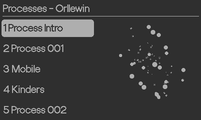

# Playdate Disc

## Playdate: music player

A general use music player isn't possible on Playdate due to the directory sandboxing/restrictions, and MP3 decoding is very expensive for the little processor, and there's no WiFi/networking API (yet, maybe sometime, maybe never), but you can bake some tracks into a project and ship a self contained album.

## Playdate Disc
Playdate Disc allows you to easily release music on the Playdate:
* Clone the repository and open in [Nova](https://nova.app/) (if you're on Mac)
* Replace the music in `/Source/Audio` with your own IMA ADPCM encoded .wavs
* Edit `Source/playlist.json`
* Edit `Source/Images/card.png` with your own artwork
* Edit `Source/pdxinfo` - change all fields (especially the bundle Id and use a valid namespace, see [ Game metadata](https://sdk.play.date/1.12.3/Inside%20Playdate.html#pdxinfo))
* Build the project, compress the .pdx directory
* Upload to your own website or distribute on itch.io

## Processes

'Processes' is some old music I wrote ~20 years ago and bundled as a Playdate Disc, you can [download it on itch.io](https://orllewin.itch.io/processes). The music's not important though (and you may not like it unless you're a fan of old netlabel drones and noise). I just like the idea of releasing albums for Playdate.

This project obviously has nothing to do with Sony or Panic, and there's no actual disc.